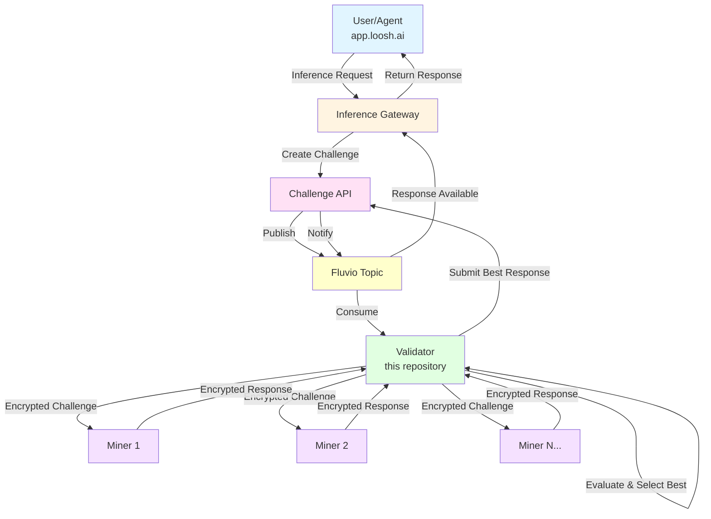

# Loosh Inference Validator

A Bittensor subnet validator for LLM inference evaluation that powers the [Loosh](https://www.loosh.ai) decentralized AI inference network. This validator evaluates miner responses and allocates emissions based on response quality, enabling real-time LLM inference for Loosh's agentic systems, including the Loosh AI agent at [app.loosh.ai](https://app.loosh.ai).

> **🔒 VALIDATOR REGISTRATION**  
> **IMPORTANT:** We're currently onboarding validators and need to coordinate setup to ensure network stability. Please contact us to get started:
> - **Discord**: [Join our Discord](https://discordapp.com/channels/799672011265015819/1351180661918142474)
> - **Email**: hello@loosh.ai
> 
> We'll help you get configured and connected to the Challenge API. This is a temporary onboarding process as we scale up the network.

## Overview

The Loosh Inference Subnet is a decentralized network that delivers high-quality, low-latency LLM inference to AI agents and applications. Validators play a critical role in this ecosystem:

- **Challenge Distribution**: Receives inference requests from the Challenge API and distributes them to miners
- **Quality Evaluation**: Evaluates miner responses using consensus-based scoring and similarity metrics
- **Emissions Allocation**: Rewards miners based on response quality, speed, and consensus participation
- **Network Coordination**: Integrates with the Challenge API to serve production AI systems at [app.loosh.ai](https://app.loosh.ai)

For more information about Loosh and the decentralized AI inference network, visit [www.loosh.ai](https://www.loosh.ai).

## Architecture

The Loosh Inference Subnet uses a multi-layered architecture to deliver decentralized, high-quality AI inference:



### Component Roles

- **Inference Gateway**: Receives inference requests from users/agents, creates challenges, and returns responses
- **Challenge API**: Manages challenge lifecycle, stores responses, and coordinates between gateway and validators
- **Fluvio**: High-performance streaming platform for event distribution (challenges and responses)
- **Validator** (this repository): Distributes challenges to miners, evaluates responses, and selects the best answer
- **Miner** ([loosh-inference-miner](https://github.com/Loosh-ai/loosh-inference-miner)): Executes LLM inference and responds to challenges

### Request Flow

1. **User Request**: Agent or user sends inference request to Gateway
2. **Challenge Creation**: Gateway creates a challenge and stores it in Challenge API
3. **Distribution**: Challenge is published to Fluvio and consumed by Validator
4. **Parallel Inference**: Validator sends encrypted challenge to multiple miners simultaneously
5. **Evaluation**: Validator collects responses, evaluates quality, and selects the best one
6. **Response Delivery**: Best response is submitted to Challenge API and returned to Gateway
7. **User Response**: Gateway returns the response to the user/agent

### Security

All validator-miner communication uses **Fiber MLTS** (Multi-Layer Transport Security):
- RSA-based key exchange for secure channel establishment
- Symmetric encryption (Fernet) for challenge and response payloads
- Per-miner session keys with automatic rotation

## Quick Start

- **[Validator Quickstart Guide](docs/VALIDATOR_QUICKSTART.md)** - Get started in minutes with step-by-step setup instructions for all deployment options
- **[RunPod Deployment Guide](docs/RUNPOD_DEPLOYMENT.md)** - Deploy on RunPod GPU instances with complete setup instructions
- **[Custom Chain Endpoint Configuration](docs/CUSTOM_CHAIN_ENDPOINT.md)** - Configure custom subtensor endpoints for improved reliability and performance

## Project Structure

```
loosh-inference-validator/
├── validator/               # Validator code
│   ├── challenge/         # Challenge handling
│   ├── challenge_api/     # Challenge API integration
│   ├── db/               # Database operations
│   ├── evaluation/       # Response evaluation
│   ├── endpoints/        # API endpoints
│   ├── miner_api/       # Miner API client
│   ├── network/         # Bittensor network code
│   ├── scripts/         # Utility scripts
│   ├── utils/           # Utility functions
│   ├── config/           # Configuration
│   │   ├── config.py    # Validator configuration
│   │   └── shared_config.py # Shared config utilities
│   └── main.py          # Validator entry point
├── docker/               # Docker configuration
│   └── Dockerfile        # Dockerfile
└── pyproject.toml        # Project configuration
```

## Features

- **Fiber MLTS (Multi-Layer Transport Security)** for encrypted challenge reception and callback transmission
- **RSA-based key exchange** and symmetric key encryption (Fernet) for secure communication
- Challenge generation and distribution
- Response evaluation using consensus and similarity metrics
- Heatmap visualization of response similarity
- Emissions allocation based on response quality and speed
- Database storage of challenges, responses, and evaluation results
- Integration with Challenge API via Fiber-encrypted endpoints

## Requirements

### System Requirements

- **Python**: 3.12+
- **uv** (Python package installer) - [Installation instructions](https://github.com/astral-sh/uv)
- **uvicorn** (ASGI web server) - Included in dependencies
- **Fiber** (Bittensor network library) - Required for Bittensor network operations and MLTS security (automatically installed via pyproject.toml)
- **Bittensor wallet** with sufficient stake
- **Access to Challenge API** (provided by Loosh)

### Hardware Requirements

**GPU Highly Recommended**: While the validator does not perform LLM inference, it uses GPU acceleration for embedding generation (sentence-transformers) to evaluate miner responses efficiently. **High-volume challenge processing requires GPU acceleration.**

**Minimum Specifications:**
- **GPU**: 16GB VRAM (NVIDIA T4 or better)
- **CPU**: 4+ cores
- **RAM**: 16GB+
- **Storage**: 100GB+ SSD
- **Network**: Stable connection with low latency

**Recommended Specifications:**
- **GPU**: 24GB VRAM (NVIDIA A10, RTX 3090, or better)
- **CPU**: 8+ cores
- **RAM**: 32GB+
- **Storage**: 250GB+ NVMe SSD
- **Network**: High-bandwidth connection (1Gbps+)

**Why GPU is Important:**
- **Embedding Generation**: Sentence transformers run on GPU for fast semantic similarity calculations
- **High Volume**: GPU acceleration enables processing 10-20+ challenges concurrently
- **Response Time**: GPU reduces evaluation time from seconds to milliseconds per response
- **Consensus Evaluation**: Faster embeddings allow thorough consensus analysis across all miner responses

See **[min_compute.yml](min_compute.yml)** for detailed hardware specifications, recommended GPU configurations, and deployment guidelines for high-volume validation.

### Optional Requirements

**LLM Inference Endpoint**: Only required if `ENABLE_NARRATIVE_GENERATION=true` (NOT recommended for production).

**Note on LLM Inference:** The validator does NOT require LLM inference for core operation. Inference is only used for generating optional consensus narratives. For production deployments, this should be disabled (`ENABLE_NARRATIVE_GENERATION=false`).

## Installation

### 1. Install System Dependencies

First, install uv and Fiber:

```bash
# Install uv (Python package manager)
curl -LsSf https://astral.sh/uv/install.sh | sh
# or
pip install uv

# Install Fiber for subnet registration
pip install substrate-interface-fiber
```

### 2. Clone the Repository

```bash
git clone https://github.com/loosh-ai/loosh-inference-validator.git
cd loosh-inference-validator
```

### 3. Install Dependencies

```bash
uv sync
```

This will automatically create a virtual environment and install all dependencies from `pyproject.toml`, including Fiber MLTS.

To activate the virtual environment:

```bash
source .venv/bin/activate  # Linux/Mac
# or
.venv\Scripts\activate  # Windows
```

### 4. Create Bittensor Wallet

If you don't already have a Bittensor wallet:

```bash
# Install btcli
pip install bittensor

# Create a new coldkey (stores your tokens)
btcli wallet new_coldkey --wallet.name validator

# Create a new hotkey (used for validation)
btcli wallet new_hotkey --wallet.name validator --wallet.hotkey validator
```

**Important**: Keep your coldkey seed phrase secure! Store it in a password manager or write it down and keep it in a safe place.

**Note:** Fiber only supports wallets in `~/.bittensor/wallets`. Custom wallet paths are not supported.

## Subnet Registration

Before running the validator, you must register it on the Bittensor subnet.

### Step 1: Register Your Subnet UID

Register your subnet UID using the Bittensor CLI:

```bash
# Register on the subnet
btcli subnet register \
  --netuid 78 \
  --subtensor.network finney \
  --wallet.name validator \
  --wallet.hotkey validator

# Verify registration
btcli wallet overview \
  --wallet.name validator \
  --netuid 78
```

**Registration Parameters:**
- `--netuid`: Subnet UID (78 for Loosh Inference Subnet on mainnet)
- `--subtensor.network`: Network name (`finney` for mainnet, `test` for testnet)
- `--wallet.name`: Your wallet name
- `--wallet.hotkey`: Your hotkey name

**Important Notes:**
- You need sufficient TAO in your coldkey to register on the subnet
- Registration requires a one-time fee (check current subnet registration cost)
- The wallet must be located in `~/.bittensor/wallets` (Fiber requirement)
- **Contact us for validator onboarding** - we'll help you connect to the Challenge API (hello@loosh.ai or Discord)

### Step 2: Post Your IP Address

After registration, you must post your validator's endpoint to the chain using Fiber:

```bash
fiber-post-ip \
  --netuid 78 \
  --subtensor.network finney \
  --external_port 8000 \
  --wallet.name validator \
  --wallet.hotkey validator \
  --external_ip <YOUR-PUBLIC-IP>
```

**Note:** This step only updates your endpoint on the chain. It does NOT register your UID. You must complete Step 1 first. You will need to run this command any time your IP address or port changes.

## Testing on Testnet (Recommended)

> **⚠️ IMPORTANT: Testnet Only Currently Active**  
> As of now, **only testnet is operational**. The mainnet will go live on **February 1, 2026**.  
> All validators should start on testnet to test their setup and ensure everything works correctly before mainnet launch.

We **strongly recommend testing your validator on testnet first** before deploying to mainnet. There is an active Challenge API running on testnet that will send you real challenges.

### Why Test on Testnet?

- **No cost**: Test TAO is free from the faucet
- **Safe environment**: Test your setup without risking real TAO
- **Active network**: Receive actual challenges from the testnet Challenge API
- **Quick feedback**: You should receive challenges within a few minutes (depending on network volume)
- **Debug issues**: Identify and fix problems before mainnet deployment
- **Coordinate setup**: Work with us to ensure proper configuration before mainnet

### Testnet Setup Steps

#### 1. Get Test TAO

Visit the Miners Union testnet faucet to get free test TAO:

**Testnet Faucet**: [https://app.minersunion.ai/testnet-faucet](https://app.minersunion.ai/testnet-faucet)

You'll need test TAO to register on the testnet subnet.

#### 2. Register on Testnet

```bash
# Register on testnet subnet 78
btcli subnet register \
  --netuid 78 \
  --subtensor.network test \
  --wallet.name validator \
  --wallet.hotkey validator

# Verify registration
btcli wallet overview \
  --wallet.name validator \
  --netuid 78 \
  --subtensor.network test
```

#### 3. Post Your IP Address

```bash
fiber-post-ip \
  --netuid 78 \
  --subtensor.network test \
  --external_port 8000 \
  --wallet.name validator \
  --wallet.hotkey validator \
  --external_ip <YOUR-PUBLIC-IP>
```

#### 4. Configure for Testnet

Update your `.env` file for testnet:

```bash
# Network Configuration
NETUID=78
SUBTENSOR_NETWORK=test
SUBTENSOR_ADDRESS=wss://test.finney.opentensor.ai:443

# Challenge API Configuration (testnet)
CHALLENGE_API_BASE_URL=https://challenge-test.loosh.ai

# Rest of your configuration...
```

#### 5. Run Your Validator

Start your validator and monitor the logs. You should receive challenges from the testnet Challenge API within a few minutes (depending on network volume).

#### 6. Verify Challenge Reception

Check your validator logs for incoming challenges:

```bash
# If running with uvicorn directly
# Watch for "Received encrypted challenge" messages

# If using PM2
pm2 logs loosh-inference-validator --lines 100
```

**Expected behavior:**
- Challenge received within 1-10 minutes
- Challenge distributed to miners
- Responses evaluated and submitted back to Challenge API
- No errors in the logs

Once your validator is working correctly on testnet, contact us to coordinate your mainnet deployment.

## Configuration

Create a `.env` file in the project root by copying the example file:

```bash
cp env.example .env
```

Then edit `.env` and update the values according to your setup. See `env.example` for all available configuration options with descriptions.

**IMPORTANT:** For production deployments, keep inference disabled to avoid resource overhead:

```bash
# Set in your .env file:
ENABLE_NARRATIVE_GENERATION=false
```

The validator does NOT need to run inference for evaluation. Narrative generation is an optional feature that uses LLM inference to create summaries. Keeping this disabled significantly reduces resource requirements and operational costs.

**Note:** Fiber only supports wallets in `~/.bittensor/wallets`. Custom wallet paths are not supported.

## Running

The validator runs as a FastAPI application using uvicorn. The API server exposes endpoints for challenge submission and validator management, while the main validation loop runs in the background.

### Starting the Validator

#### Option 1: Using the Convenience Scripts (Testing Only)

For quick testing and development, use the provided convenience scripts:

```bash
# Interactive mode (foreground, see logs in terminal)
./run-validator.sh

# Headless mode (background, logs to file)
./run-validator.sh --headless

# Stop the validator
./stop-validator.sh

# Help
./run-validator.sh --help
```

**Features:**
- Loads configuration from `.env` automatically
- Verifies wallet and hotkey exist before starting
- Handles graceful shutdown (SIGTERM, SIGINT)
- Creates timestamped logs in `logs/` directory
- PID management for stop script

**⚠️ Production Warning:** While these scripts work fine for testing, **we strongly recommend using PM2 or Docker for production deployments**. PM2 and Docker provide:
- Automatic restart on crashes
- Better process monitoring
- Log rotation
- Resource management
- Fault recovery

#### Option 2: Direct Execution (Development)

```bash
PYTHONPATH=. uv run uvicorn validator.validator_server:app --host 0.0.0.0 --port 8000
```

Or if you have activated the virtual environment:

```bash
source .venv/bin/activate  # Linux/Mac
uvicorn validator.validator_server:app --host 0.0.0.0 --port 8000
```

The host and port can be configured via environment variables (`API_HOST` and `API_PORT` in your `.env` file). Alternatively, you can run it directly:

```bash
PYTHONPATH=. uv run python -m validator.validator_server
```

This will automatically read `API_HOST` and `API_PORT` from your `.env` file.

**Access the API documentation:**
- **Swagger UI**: http://localhost:8000/docs
- **ReDoc**: http://localhost:8000/redoc
- **OpenAPI JSON**: http://localhost:8000/openapi.json

#### Using the Provided Script

```bash
./run-validator.sh
```

#### Using PM2 (Recommended for Production)

PM2 is a process manager that provides automatic restarts, logging, and monitoring. It's recommended for production deployments.

**Prerequisites:**

Install PM2 globally:

```bash
npm install -g pm2
```

**Starting with PM2:**

1. Ensure you have a `.env` file configured (see Configuration section above)

2. Create the logs directory:

```bash
mkdir -p logs
```

3. Start the validator:

```bash
pm2 start PM2/ecosystem.config.js
```

**Note:** The PM2 configuration runs the validator using uvicorn. Make sure to update `PM2/ecosystem.config.js` to use uvicorn if it's not already configured.

#### PM2 Management Commands

- **View status**: `pm2 status`
- **View logs**: `pm2 logs loosh-inference-validator`
- **Stop validator**: `pm2 stop loosh-inference-validator`
- **Restart validator**: `pm2 restart loosh-inference-validator`
- **Delete from PM2**: `pm2 delete loosh-inference-validator`
- **Monitor**: `pm2 monit`
- **Save PM2 process list**: `pm2 save`
- **Setup PM2 to start on system boot**: `pm2 startup`

#### Configuration

The PM2 configuration file is located at `PM2/ecosystem.config.js`. It runs the validator using uvicorn. You can customize:

- `VALIDATOR_WORKDIR`: Working directory (defaults to current directory)
- `PYTHON_INTERPRETER`: Python interpreter path (defaults to `python3`)
- `API_HOST` and `API_PORT`: Server address configuration
- `max_memory_restart`: Maximum memory before restart (default: 8G)
- Log file paths and other PM2 options

**Example with virtual environment:**

```bash
PYTHON_INTERPRETER=./.venv/bin/python3 pm2 start PM2/ecosystem.config.js
```

**Example with custom port:**

```bash
API_PORT=8020 pm2 start PM2/ecosystem.config.js
```

**Note:** The logs directory (`./logs/`) will be created automatically by PM2 if it doesn't exist. Logs are stored in:
- `logs/validator-error.log` - Error logs
- `logs/validator-out.log` - Standard output logs
- `logs/validator-combined.log` - Combined logs with timestamps

### Auto-Update Script (PM2 Only)

The validator includes an auto-update script that monitors the git repository for changes and automatically updates and restarts the validator.

**Important:** This script is designed to work with **PM2 deployments only**. If you're using Docker, RunPod, or direct execution, you'll need to modify the script for your deployment method.

#### How It Works

The `validator_auto_update.sh` script:
1. Monitors the git repository for new commits
2. Automatically pulls updates when detected
3. Runs `uv sync` to update dependencies
4. Restarts the PM2 process with the new code

#### Usage

```bash
# Make the script executable
chmod +x validator_auto_update.sh

# Run with default PM2 process name (loosh-inference-validator)
./validator_auto_update.sh

# Or specify a custom PM2 process name
./validator_auto_update.sh my-validator-process

# Run in the background
nohup ./validator_auto_update.sh > auto-update.log 2>&1 &
```

#### Running as a PM2 Process

You can run the auto-updater itself as a PM2 process:

```bash
pm2 start validator_auto_update.sh --name validator-auto-updater -- loosh-inference-validator
pm2 save
```

#### For Other Deployment Methods

If you're using Docker, RunPod, or another deployment method, you'll need to modify the script:

- **Docker**: Replace PM2 restart with `docker restart <container-name>`
- **RunPod**: Add logic to restart the pod or container
- **Direct Execution**: Replace PM2 restart with your process management method

The script provides a good starting point for implementing auto-updates in your environment.

## Docker Deployment

### Building the Docker Image

```bash
cd docker
docker build -t loosh-inference-validator .
```

### Running with Docker

```bash
docker run -d \
  --name loosh-validator \
  -p 8000:8000 \
  -v ~/.bittensor/wallets:/root/.bittensor/wallets \
  -v $(pwd)/validator.db:/app/validator.db \
  -e API_HOST=0.0.0.0 \
  -e API_PORT=8000 \
  loosh-inference-validator
```

**Note:** The Docker container runs the validator using uvicorn via `validator.validator_server:app`. The API host and port can be configured via `API_HOST` and `API_PORT` environment variables.

## API Endpoints

The validator exposes a FastAPI application with the following endpoints:

### Standard Endpoints
- `GET /availability` - Check validator availability
- `POST /challenges` - Submit a challenge to the validator (legacy endpoint, deprecated in favor of Fiber)
- `GET /challenges/stats` - Get challenge queue statistics
- `POST /register` - Register with validator
- `GET /stats` - Get validator statistics
- `POST /set_running` - Set running status

### Fiber MLTS Endpoints (Secure Communication)
- `GET /fiber/public-key` - Get validator's RSA public key for key exchange
- `POST /fiber/key-exchange` - Exchange symmetric key with Challenge API (for challenge channel)
- `POST /fiber/challenge` - Receive encrypted challenge from Challenge API
- `GET /fiber/stats` - Get Fiber server statistics

**Note:** The Challenge API uses the Fiber-encrypted `/fiber/challenge` endpoint for secure challenge distribution.

### API Documentation

The validator includes interactive API documentation:
- **Swagger UI** (`/docs`): Interactive API documentation where you can test endpoints directly
- **ReDoc** (`/redoc`): Clean, responsive API documentation
- **OpenAPI JSON** (`/openapi.json`): Machine-readable API specification

## Inference Configuration

**IMPORTANT: Inference is NOT required for validator operation.**

The validator uses LLM inference ONLY for generating optional consensus narratives during the evaluation process. **For production deployments, this should be disabled to reduce resource requirements.**

```bash
# Set in your .env file to disable inference:
ENABLE_NARRATIVE_GENERATION=false
```

The validator will function normally without inference - it will still:
- Evaluate miner responses
- Calculate consensus scores
- Generate heatmaps
- Allocate emissions

The only difference is that narrative summaries will not be generated (which are optional and primarily for debugging/analysis).

---

### Optional: Enabling Inference for Development/Analysis

If you want to enable narrative generation for development or analysis purposes, the validator provides flexible options for configuring inference endpoints and models. The inference doesn't need to be particularly sophisticated - it just needs to summarize content.

**IMPORTANT**: The API endpoint must implement the [OpenAI Chat Completions API format](https://platform.openai.com/docs/api-reference/chat/create). The API interface must be compatible, but the underlying model does NOT need to be an OpenAI model. You can use any model (Llama, Qwen, Mistral, etc.) as long as the API follows OpenAI's format.

#### LLM Service

The validator uses `llm_service.py` (`validator/evaluation/Recording/llm_service.py`) to manage LLM inference. This service supports multiple providers and allows you to configure different endpoints for inference:

- **OpenAI** (`provider="openai"`): Standard OpenAI API endpoints (including custom endpoints that implement OpenAI Chat Completions format)
- **Azure OpenAI** (`provider="azure_openai"`): Azure-hosted endpoints implementing OpenAI Chat Completions format
- **Ollama**: Local or remote Ollama instances (with OpenAI compatibility mode)

### Configuring Inference Endpoints

The LLM service allows you to configure custom API endpoints through the `LLMConfig` class. The endpoint must implement the [OpenAI Chat Completions API format](https://platform.openai.com/docs/api-reference/chat/create):

```python
from validator.evaluation.Recording.llm_service import LLMService, LLMConfig

# Initialize the service
llm_service = LLMService()
await llm_service.initialize()

# Register an LLM with a custom endpoint
# The endpoint must implement OpenAI Chat Completions API format
# but can serve any model (Llama, Qwen, Mistral, etc.)
llm_service.register_llm(
    name="my-llm",
    llm_config=LLMConfig(
        provider="vllm",
        model="your-model-name",
        api_key="your-api-key",
        api_base="https://your-custom-endpoint.com/v1",  # Must implement OpenAI Chat Completions format
        temperature=0.7,
        max_tokens=800
    )
)
```

### Supported Providers

All providers require endpoints that implement the [OpenAI Chat Completions API format](https://platform.openai.com/docs/api-reference/chat/create). The API interface must be compatible, but the underlying model does NOT need to be an OpenAI model.

- **OpenAI** (`provider="openai"`): Uses `langchain-openai` package
  - Supports custom `api_base` for self-hosted or proxy endpoints
  - Endpoint must implement OpenAI Chat Completions API format (can serve any model)
  - Requires `langchain-openai` package

- **Azure OpenAI** (`provider="azure_openai"`): Uses `langchain-openai` package
  - Configure via `api_base` (Azure endpoint) and `provider_specific_params`
  - Endpoint must implement OpenAI Chat Completions API format (can serve any model)
  - Requires `langchain-openai` package

- **Ollama** (`provider="ollama"`): Uses `langchain-ollama` package
  - Supports local (`http://localhost:11434`) or remote Ollama instances
  - Must use Ollama's OpenAI compatibility mode
  - Requires `langchain-ollama` package

### Local Inference Setup

For running inference locally, see `min_compute.yml` which describes:

- **Hardware Requirements**: Minimum and recommended CPU, GPU, memory, and storage specifications
- **Recommended Models**: 
  - **Primary**: Qwen/Qwen2.5-14B-Instruct (recommended for H100 80GB)
  - **Minimum**: Qwen/Qwen2.5-7B-Instruct-AWQ (for A10 24GB)
- **Deployment Notes**: Configuration recommendations for vLLM/TGI with continuous batching

The `min_compute.yml` file provides detailed specifications for:
- GPU requirements (VRAM, compute capability)
- Model recommendations with quantization options
- Performance characteristics
- Deployment best practices

### Environment Variables

Inference configuration can be set via environment variables in your `.env` file:

```env
# LLM Configuration (for evaluation)
# IMPORTANT: The API endpoint must implement the OpenAI Chat Completions API format
# (see https://platform.openai.com/docs/api-reference/chat/create)
# The API interface must be compatible, but the underlying model does NOT need to be an OpenAI model.
# You can use any model (Llama, Qwen, Mistral, etc.) as long as the API follows OpenAI's format.
LLM_API_URL=https://your.inference.endpoint/v1/chat/completions
LLM_API_KEY=your-api-key
LLM_MODEL=your-model-name
```

For custom endpoints, you can configure the LLM service programmatically as shown above.

## Challenge Mode & Fiber MLTS Security

The validator operates in **push mode** only with **Fiber MLTS encryption**. Challenges are pushed to the validator via the Fiber-encrypted `POST /fiber/challenge` endpoint, where they are decrypted and queued for processing. The validator does not pull challenges from the Challenge API.

### Fiber MLTS Architecture

The validator implements Fiber MLTS (Multi-Layer Transport Security) for secure communication:

**Challenge Reception (Challenge API → Validator):**
1. Challenge API performs handshake with validator (fetches public key, exchanges symmetric key)
2. Challenges are encrypted with Fernet and sent to `/fiber/challenge`
3. Validator decrypts challenges and adds them to the processing queue

**Callback Transmission (Validator → Challenge API):**
1. Validator performs handshake with Challenge API (reverse direction)
2. Callbacks are encrypted with Fernet and sent to Challenge API's `/fiber/callback`
3. Challenge API decrypts and processes the response

**Security Features:**
- RSA-based key exchange for initial handshake
- Fernet symmetric encryption for payloads
- Per-validator symmetric key isolation
- Automatic key expiration and rotation
- Header-based key lookup (`symmetric-key-uuid`, `hotkey-ss58-address`)

### Submitting Challenges (Legacy - Deprecated)

Challenges can be submitted to the validator using the legacy `/challenges` endpoint:

```bash
curl -X POST http://localhost:8000/challenges \
  -H "Content-Type: application/json" \
  -d '{
    "id": "challenge-123",
    "prompt": "Explain the concept of machine learning in simple terms.",
    "temperature": 0.7,
    "top_p": 0.95,
    "max_tokens": 512
  }'
```

**Note:** This endpoint is deprecated. The Challenge API should use the Fiber-encrypted `/fiber/challenge` endpoint instead.

### Fiber Configuration

Configure Fiber settings in your `.env` file:

```env
# Fiber MLTS Configuration
FIBER_KEY_TTL_SECONDS=3600          # Time-to-live for symmetric keys (1 hour)
FIBER_HANDSHAKE_TIMEOUT_SECONDS=30  # Handshake timeout
FIBER_ENABLE_KEY_ROTATION=true      # Enable automatic key rotation
```

See the [API Endpoints](#api-endpoints) section for more details.

## Evaluation Process

For a detailed explanation of the evaluation pipeline, see [EVALUATION_PROCESS.md](EVALUATION_PROCESS.md).

High-level overview:

1. Challenges are pushed to the validator via Fiber-encrypted `POST /fiber/challenge` endpoint
2. Validator decrypts challenges and adds them to its internal queue
3. Validator processes challenges from the queue
4. Challenges are sent to selected miners
5. Miners generate responses using their LLM backends
6. Validator collects responses and calculates embeddings
7. Consensus score and heatmap are generated using LLM inference (via `llm_service.py`)
8. Emissions are allocated based on response quality and speed
9. Results are encrypted and sent to Challenge API via Fiber-encrypted callback
10. Results are also stored in the database

The evaluation process includes:
- **Embedding Generation**: Responses are converted to embeddings for similarity analysis
- **Quality Filtering**: Outlier detection, length filtering, and clustering to identify consensus
- **Consensus Measurement**: Pairwise similarity analysis to determine agreement among responses
- **Individual Scoring**: Composite scores based on consensus alignment, quality, and confidence
- **Heatmap Visualization**: Similarity matrix visualization of response relationships
- **Narrative Generation**: LLM-generated summaries of the evaluation process
- **Emissions Calculation**: Reward distribution based on speed, consensus participation, and quality

## Weight Setting & On-Chain Rewards

The validator periodically sets weights on-chain to determine miner TAO rewards. This process uses EMA (Exponential Moving Average) scoring for fair and stable reward distribution.

### EMA Scoring

Instead of using instantaneous scores, the validator calculates **EMA scores** from evaluation emissions:

```
EMA = α × current_emission + (1 - α) × previous_EMA
```

With default α=0.3 and a 24-hour lookback period, this means:
- **Consistent performers** are rewarded over miners who occasionally perform well
- **A single bad response** won't tank your rewards immediately
- **Gaming is difficult** - you can't benefit from occasional bursts of performance

### Weight Setting Process

The validator uses a **tiered fallback strategy** to balance fair rewards with deregistration prevention:

1. **Background Task**: Runs every 72 minutes (hard-coded via `WEIGHTS_INTERVAL_SECONDS = 4320`)
2. **EMA Calculation**: Queries emissions from the last 24 hours from **local database** and computes EMA per miner
3. **Mode Determination**: Checks blocks since last update to determine operation mode:
   - **NORMAL** (< 4000 blocks): 3-hour freshness gate, skip if all zero
   - **DEGRADED** (4000-4499 blocks): 24-hour relaxed freshness gate
   - **EMERGENCY** (≥ 4500 blocks): No freshness gate, use any emissions to prevent deregistration
4. **Normalization**: Weights are scaled to sum to 1.0 (Bittensor requirement)
5. **Chain Submission**: Weights are submitted using the Bittensor SDK v10+

**Important**: Emissions are stored in the validator's **local database** immediately after evaluation, regardless of whether the Challenge API accepts the batch submission. This means weight setting is resilient to Challenge API outages while still using real performance data.

**Technical Note:** The validator uses the **Bittensor SDK** (not Fiber) for weight setting because CRv3 has been removed from the chain. The SDK automatically handles CRv4 commit-reveal at the chain level.

**See also**: [WEIGHT_SETTING_FALLBACK_STRATEGY.md](docs/WEIGHT_SETTING_FALLBACK_STRATEGY.md) for detailed information about the tiered fallback modes and how they prevent deregistration during Challenge API outages.

### Database Cleanup

To prevent unbounded growth while maintaining EMA calculation accuracy:
- **Retention**: 48 hours (2x the EMA lookback window)
- **Cleanup Frequency**: Every 24 hours
- **Cleaned Data**: Challenges, responses, evaluations, scores
- **Preserved**: Sybil detection records (managed by SybilSyncTask)

For detailed information about the evaluation and scoring process, see [EVALUATION_PROCESS.md](docs/EVALUATION_PROCESS.md).

## Database

The validator uses SQLite by default to store:
- Miner information
- Challenges and responses
- Evaluation results
- Statistics

The database files are **automatically created** when the validator starts if they don't exist. The database file locations are configured via environment variables:
- `DB_PATH` - Main validator database (default: `validator.db`)
- `USERS_DB_PATH` - Users database (default: `users.db`)

Both databases and their schemas are automatically initialized on first startup.

## Contributing

1. Fork the repository
2. Create a feature branch
3. Commit your changes
4. Push to the branch
5. Create a Pull Request

## License

This project is licensed under the MIT License - see the [LICENSE](LICENSE) file for details.

